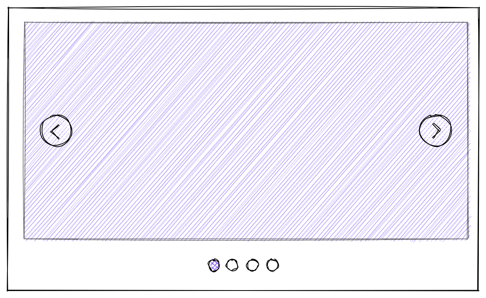
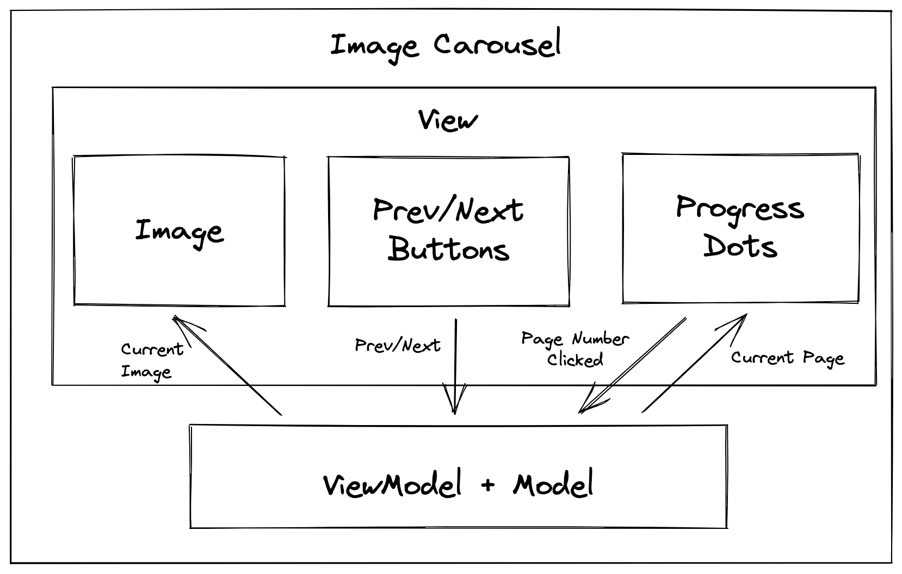

# Image Carousel

### Question

Design an image carousel component that displays a list of images one at a time, allowing the user to browse through them with pagination buttons.



---

## Requirements Exploration

### How are the images specified?

It will be a configuration option on the component and the list of images must be specified before initializing the component.

### What devices should the component support?

Desktop, tablet, and mobile.

### How will the pagination buttons behave when the user is at the start/end of the image list?

It should cycle through infinitely.

### Will there be animation when transitioning between images?

Yes, the images should animate with horizontal translation.

---

## Architecture / High-Level Design

Since this component doesn't need any server data, our architecture will just consist of the client-side components.



---

## Component Responsibilities

- **ViewModel + Model**  
  The brain of the component, holds the configuration and state of the component, orchestrates events between the components and informs the "Image" component which image to render.

- **Image**  
  Displays the currently selected image.

- **Prev/Next Buttons**  
  Tells the "ViewModel" to change to the prev/next image depending on which button is clicked.

- **Progress Dots**  
  Tells the "ViewModel" which image to show when the respective dot/page is being clicked/selected.

> There's no need to separate the "Model" and the "ViewModel" in this component because it's a small component.

---

## Flux Architecture

A Flux/Redux/Reducer-like architecture is recommended to abstract away the action sources from the action logic/implementation. Some actions can be triggered by interacting with various UI elements, periodically by a timer, or keypresses.

---

## Data Model

Only the "ViewModel" will hold any state and data, the other components are part of the view and won't hold data. It can contain the following fields:

- **Configuration**

  - List of images, which includes both the image URL and alt value, if provided.
  - Transition duration.
  - Size: Height and width of the image.

- **State**
  - Index of current image. This value can be modified by the interactive elements (Prev/Next buttons, Progress Dots).

---

## Interface Definition (API)

Since we're talking about designing a UI component here, API will focus on the external API of the components: what configuration options are provided so that developers can use the component in a customized fashion.

### Basic API

- **List of images**: An array of image URLs to be displayed within the carousel with any associated metadata (optional but good to have).
- **Transition duration (ms)**: Duration for the translation animation during image transitions.
- **Height (px)**: Height of the image.
- **Width (px)**: Width of the image.

### Example of an ImageCarousel component defined in React:

```
<ImageCarousel
images={[
{ src: 'https://example.com/images/foo.jpg', alt: 'A foo' },
{ src: 'https://example.com/images/bar.jpg', alt: 'A bar' },
/* More images if desired. */
]}
transitionDuration={300}
height={500}
width={800}
/>
```

### Advanced API

These are non-essential APIs but worth a discussion if there's time:

- **Autoplay**: Whether the carousel will automatically progress to the next image after some time.

  - A timer state value will be needed to keep incrementing the image.
  - The timer should be cancelled/reset if the current image was manually changed by the user (either through Prev/Next buttons or Progress dots).

- **Delay**: Delay between transitions. Only needed if the carousel is in autoplay mode.

- **Event listeners**: It'd be useful to add event listeners to buttons of the component so that developers can implement their own extra functionality (e.g. logging user interactions).
  - `onLoad`: When the first image is done loading and shown in the carousel.

---


_The box with the black border indicates the currently visible window._

---

## Sample Code

### HTML

```
<div class="carousel-images">    <!-- More images --> </div>
```

```
.carousel-images {
  display: flex;
  height: 400px;
  width: 600px;
  overflow: hidden;
}

.carousel-image {
  height: 400px;
  width: 600px;
}
```

JavaScript (Smooth scroll to image)

```
document.querySelector('.carousel-images').scrollTo({
  left: selectedIndex * 600,
  behavior: 'smooth',
});
```

Fitting Images

The layout above assumes that all the images are of the same size. However, it is unlikely that the user will provide images that are of that exact size.

Here are a few ways we can get around this:
CSS background-size

This requires a change in the HTML to render the image using CSS background/background-image instead of ``. The advantage of this is that we can use the background-size property that has these two modes:

    contain: Scales the image as large as possible within its container without cropping or stretching the image. If the container is larger than the image, this will result in image tiling, unless the background-repeat property is set to no-repeat.

    cover: Scales the image (while preserving its ratio) to the smallest possible size to fill the container (that is: both its height and width completely cover the container), leaving no empty space. If the proportions of the background differ from the element, the image is cropped either vertically or horizontally.

    Source: background-size - CSS: Cascading Style Sheets | MDN

Both advantages have their merits and which to use really depends on the provided images. One way is to allow the developer to customize whether to use contain or cover for all the images or even allow customizing this setting for individual images.

CSS object-fit

CSS object-fit is a feature that is similar to how background-size works for background-images, but for `` and `<video>` HTML tags. It has contain and cover properties as well which work the same way as background-size's version.

This way is preferred since it's more semantic to use `` tags than `<div>`s with background-images.
Vertically-center Buttons

To vertically center the buttons, we can use position: absolute on the buttons along with some transform: translateY(-50%) to shift it up by half its height.
HTML

```
<div class="carousel-image-container">
  <div class="carousel-images">
    
    
    <!-- More images -->
  </div>
  <button class="carousel-button carousel-button-prev">‹</button>
  <button class="carousel-button carousel-button-next">›</button>
</div>
```

CSS

```
.carousel-image-container {
  height: 400px;
  width: 600px;
  position: relative; /* So that position: absolute will be relative to this element. */
}

.carousel-button {
  position: absolute;
  top: 50%;
  transform: translateY(-50%);
  background: rgba(0,0,0,0.5);
  border: none;
  color: white;
  font-size: 2rem;
  padding: 0.5rem 1rem;
  cursor: pointer;
  border-radius: 50%;
  user-select: none;
}

.carousel-button-prev {
  left: 10px;
}

.carousel-button-next {
  right: 10px;
}
```
